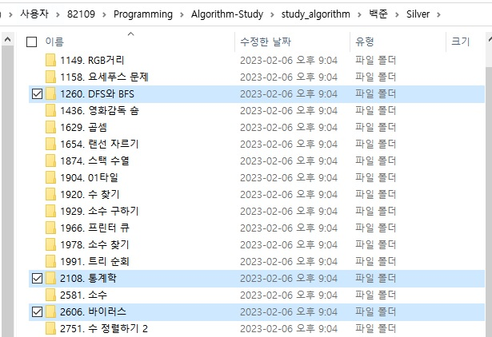
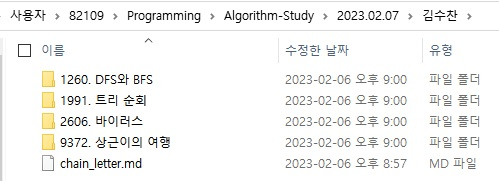

# 작업 환경 이렇게 설정해주세요!

>**다들 파일 어떻게 불러오는지 몰라 간단하게 만들었습니다.**

# 사용법
## 0. 자신의 백준허브폴더에서 git pull 합니다.

<br>

## 2. 자신의 백준허브에서 풀었던 문제들을 스터디 날짜로 옮깁니다.

<div align="center">
  <table>
    <td>
      </img>
    </td>
    <td>
      </img>
    </td>
  <table>
</div>

<div align="left">

## 2. 알고리즘 스터디를 git push 하면 끗

<br><br>

# 기본환경 샛팅
## 0. git pull 을 통해 현재 폴더 업데이트

<br>


## 1. 알고리즘 스터디 main에 자신의 백준 허브를 clone 합니다.
  - git clone "your repository"
  ```
  clone 하신 뒤에 .gitignore에 양식을 맞춰서 자신의 허브를 ignore 시킵니다.
  ```
<br>

## 2. 그러면 쉽게 가져오고 쉽게 올릴 수 있습니다. 일단 전 이렇게함...[김수찬]

</div>

